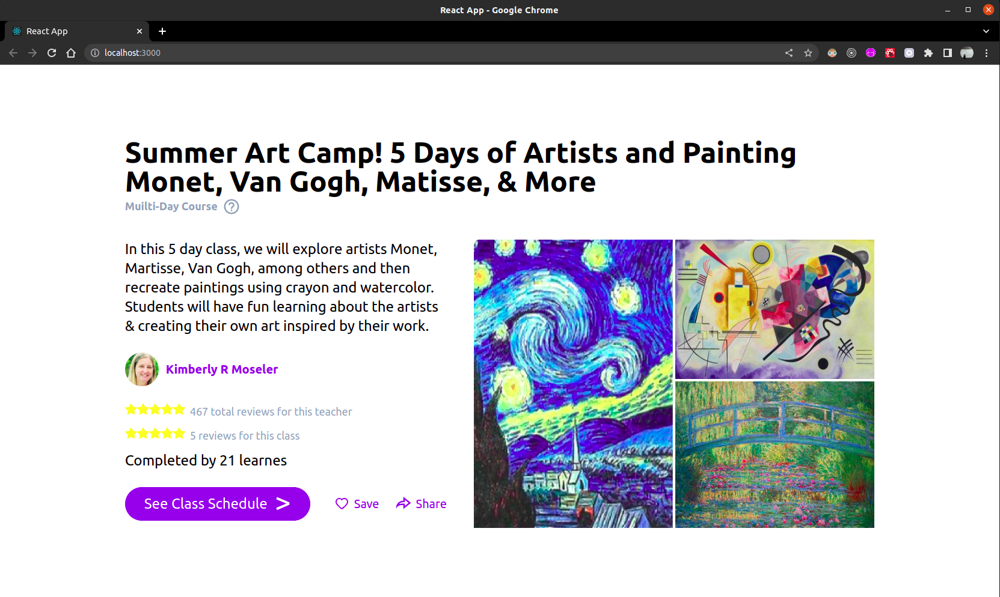

# Kaholas Assignment

This is an assignment assigned by Kaholas for the role of React Developer Intern.

Technologies used - Reactjs, Tailwind CSS, Vercel

 

Assigned Task -  
Create this page on nextjs/reactjs using data in the image stored as json data and using tailwind or similar CSS framework.

 

Output -  
Live - https://kaholas-assignment-one.vercel.app/

